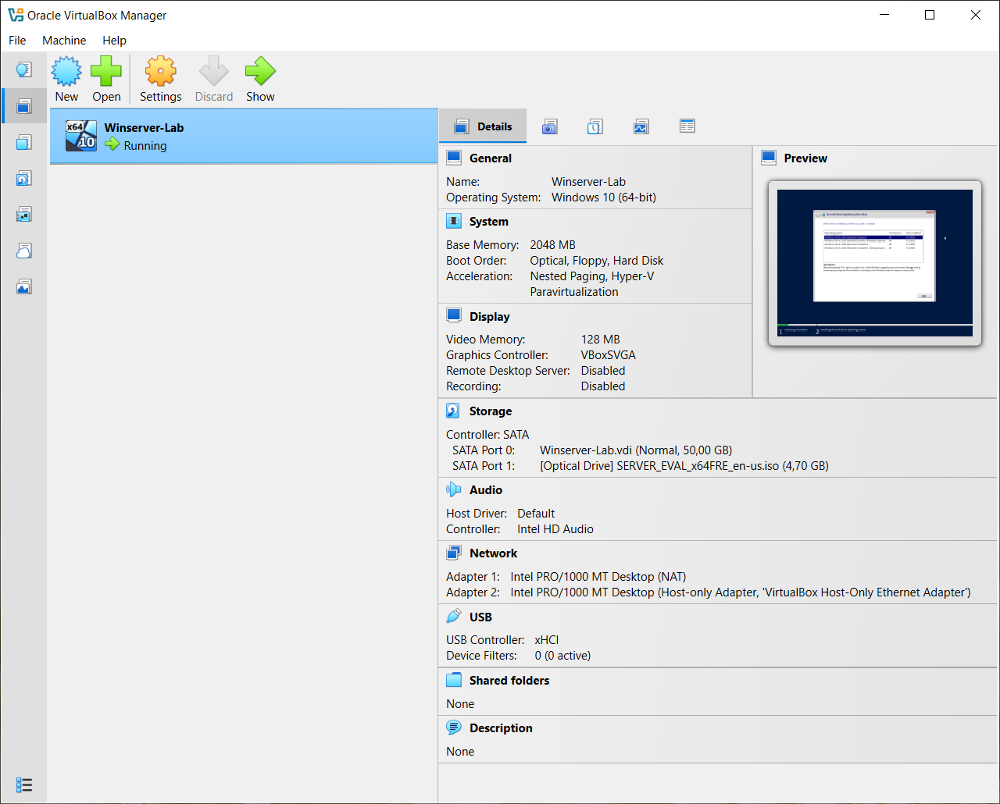
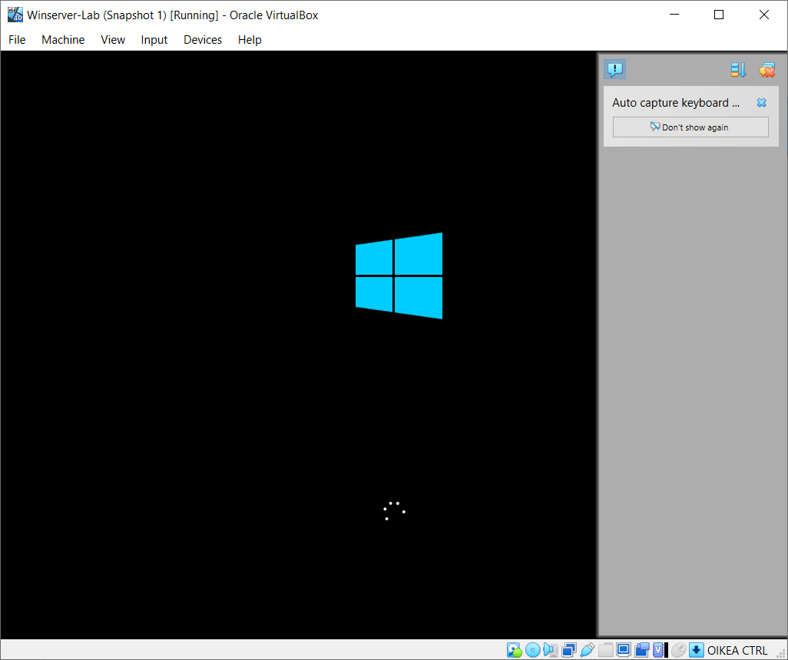
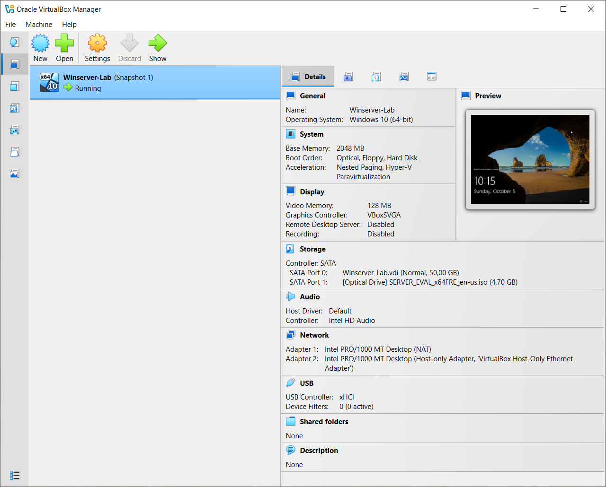

# Hospital-IT-Lab
Hands-on demo simulating a hospital IT install and upgrade environment using Windows Server, SQL, and PowerShell — created for GE Healthcare internship application.

# Steps Completed:
1. Set up a virtual environment in VirtualBox.
2. Successfully installed and configured Windows Server 2022 Evaluation.
3. Navigated BIOS virtualization settings and resolved AMD-V/Hyper-V conflicts.
4. Installed Guest Additions and verified networking configuration.
5. Downloaded and prepared SQL Server Express for future setup.

# Snapshots from VM during installation and final stages: 
1. Oracle VirtualBox Manager dashboard showcasing a running Virtual Machine "Winserver-Lab" 
2. First boot picture of Windows in Winserver-Lab. 
3. Preview window - far right showing live footage from running VM of the log in page. 
